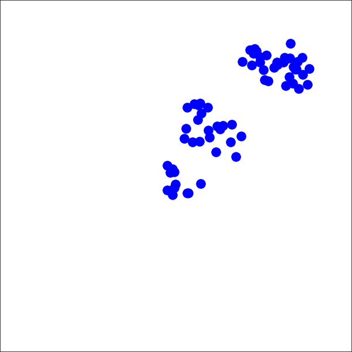

# Submission 4989

## Example
Please have a look at the [example](examples/example_eggp_graph_interaction.ipynb) using an e-GGP trained model in the Graph Interaction environment


## Project structure
This repo has the following structure:

```
.
├── e_ggp/
│   ├── evolving_gp.py: e-GGP model.
│   ├── kernels.py: attributed sub-tree kernel used in e-GGP .
│   ├── exact_gp.py: GPR model. 
│   └── utils/
│       ├── data_utils.py: utils for selecting training points, storing results and others.
│       ├── datasets.py: definition of graphs based on K-D tree, K-neighbours and the connectivity Rnn.
│       ├── graph_utils.py: adjacency list to matrix conversion.
│       └── plot_utils.py : plot utils used for the tests.
├── datasets/
│   ├── graph_interaction_test/
│   ├── isolated_subgraphs_test/
│   ├── graph_interaction_origin.npy
│   └── isolated_subgraphs_44_particle.npy
├── examples
│   └── example_eggp_graph_interaction.jpy: Jupyter example
├── train_eggp.py: File for training and testing e-GGP.

```

## Requirements
To install the requirements you can run
```bash
pip install -r requirements.txt
```

## Training and testing e-GGP
### Graph-Interaction environment
The first time you run using a data set you must use the flag `--new_dataset`.
This will create `.pkl` files to avoid creating new data sets every time the code is run.

```bash
python3 train_eggp.py  -df datasets/graph_interaction_origin.npy
-dt datasets/graph_interaction_test/ --new_dataset
```
Required arguments:
- `--data_limit 15`: set the limit of training points.
- `--targets 3 5`: train and test for the targets Vx and Vy.
- `--priors`: flag to add prior information on the connectivity of the rope and the sphere.


### Isolated evolving sub-graphs environment
Use the following command:
```bash
python3 train_eggp.py  -df datasets/isolated_subgraphs_44_particle.npy
-dt datasets/isolated_subgraphs_test/ --new_dataset
```
Required arguments:
- `--data_limit 15`: set the limit of training points.
- `--targets 2 3`: train and test for the targets Vx and Vy.
- `--conn_r`: Connectivity radius used for the isolated subgraphs dataset
- `--k_nn`: k-neighbours to look for.

**Kernel parameters:**
- `--root_kernel`: root kernel to use (RBF/Matern52/Matern32)
- `--leaf_kernel`: leaf kernel to use (RBF/Matern52/Matern32)

**Data parameters:**
- `--fixed_adj`: whether the adjacency matrix is fixed for all the graph sequences or not.
- `--new_dataset`: flag to use when using a data set for the first time.
- `--shuffle`: whether to shuffle the training data or not
- `--output_folder`: where to save the Tensorboard, figures and results CSV file.
- `--load_eggp_model`: load a single model for a target e.g. Vx or Vy.

**Plot parameters**
- `--graph_plot`: plot the graph connectivity for the data set.
- `--plot`: plot the predictive mean and variance of the test data.
- `--vel_plot`: plot the targets and derivatives of the targets.


## Environments

**Graph-Interaction environment** | **Isolated evolving sub-graphs environment**
------ | ------
   |  


The Graph-Interaction environment is based on [MuJoCo-Py](https://github.com/openai/mujoco-py).

The code for the isolated evolving sub-graphs environment can be found in
`environments/water_2d.py`.

The environment is based on [Taichi-MPM](https://github.com/yuanming-hu/taichi_mpm) 
and [Taichi-elements](https://github.com/taichi-dev/taichi_elements/)


